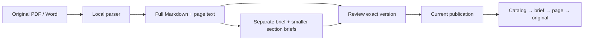

# agent-library

**A governed document library that AI agents can read one layer at a time.**

[繁體中文](README.zh-TW.md) · [Architecture](docs/architecture.md) · [Governance](docs/governance.md) · [Known failure modes](docs/failure-modes.md)

The [product specification](docs/product-spec.md) separates the longer-term quality
management platform from the current reference core. For an existing library, start
with the [read-only inventory audit](docs/inventory-audit.md); a sidecar's existence
does not establish extraction completeness or approval.

One original PDF or Word revision produces a full-text Markdown file **and a separate navigation brief**. An agent follows a small catalog, opens a brief, and reads the relevant source pages. No vector database, model account, or cloud service is required by the core.



## What works in v0.1

- Read-only source ingestion, repeated scan reconciliation, immutable source snapshots, full text and separate hierarchical briefs.
- Explicit plan → review → approve → apply for publishing, archiving and restoring; content hashes and an expected-current check protect a reviewed change from concurrent updates.
- Current-only lexical retrieval, aliases, page references, extraction-quality checks and explicit stale-inventory errors.
- Portable Markdown bundles, integrity verification, audit events, synthetic end-to-end examples and Windows/Linux tests.

This is a **single-host reference implementation**. Google Drive transport, NAS deployment, semantic/LLM summaries, authenticated multi-user approvals and unattended lifecycle decisions are [planned](docs/roadmap.md). The core neither uploads company documents nor configures a scheduler.

## Try it

Python 3.11+ and Git are enough for the text example. Run from a checkout; the distribution has not been published to PyPI.

```sh
git clone https://github.com/masalu0105-gif/agent-library.git
cd agent-library
python -m venv .venv
# Activate .venv using your shell's usual command.
python -m pip install .
python examples/demo.py
python -m unittest discover -s tests -v
```

The demo generates synthetic source text in a temporary directory, publishes two revisions, archives, restores, reads a brief and page, then verifies an exported bundle. For a bundle you can browse, pass `--output` with a **new directory outside the checkout**, for example:

```sh
python examples/demo.py --output ../agent-library-demo
```

Open `agent-library-demo/bundle/_AI_MAP.md` in Obsidian or any Markdown reader. Follow the links down to the original. Examples contain no company files or credentials.

For PDF/Word, install the tested optional parser:

```sh
npm install -g @llamaindex/liteparse@2.0.0
python examples/verify_liteparse.py
# Requires LibreOffice for Word conversion:
python examples/verify_liteparse.py --office
```

On Windows use `npm.cmd` if PowerShell blocks npm's `.ps1` shim. The adapter invokes `lit.cmd` on Windows and `lit` on Linux. OCR is off by default; see [parser fidelity and dependencies](docs/parsers.md).

## The reading path

| Layer | Artifact | Purpose |
| --- | --- | --- |
| L0 | `00_CONSTITUTION.md` | Reading rules and trust boundaries |
| L1 | `_AI_MAP.md` | Choose a category; large catalogs split into smaller files |
| L2 | `groups/*.md` | Choose a document, at most 32 entries per catalog |
| L2.5 | `brief.md` → `sections/*.md` | At most 8 child links per brief; short source excerpts |
| L3 | `full.md#page-N`, `extraction.json` | Read the actual page text |
| L4 | `original.pdf` / `original.docx` | Inspect or deliver the preserved source bytes |

Current briefs are **extractive navigation**, not semantic summaries. Full Markdown retains all text returned by the parser; it does not certify that OCR, table structure, images or page layout were reproduced perfectly. Publication is an operational approval, not a claim of regulatory validity.

## Operating your own private library

Keep sources, runtime and exported bundles in three separate directories outside this repository. Initialize using explicit source allowlists:

```sh
agent-library --home /private/library-runtime init --source /private/source-documents
agent-library --home /private/library-runtime scan
agent-library --home /private/library-runtime ingest /private/source-documents/example.pdf
```

Replace paths with your own absolute paths. `scan` waits for two identical observations and the configured quiet interval before ingestion; `ingest` is an explicit immediate capture with before/after consistency checks. Neither publishes automatically.

Use the returned version ID to inspect both generated artifacts and the source, then review the exact plan:

```sh
agent-library --home /private/library-runtime brief VERSION_ID --historical
agent-library --home /private/library-runtime read VERSION_ID --historical --page 1
agent-library --home /private/library-runtime read VERSION_ID --historical --source
agent-library --home /private/library-runtime plan VERSION_ID --reason "Reviewed source and extraction"
agent-library --home /private/library-runtime approve PLAN_ID --digest PLAN_SHA256 --reviewer operator
agent-library --home /private/library-runtime apply PLAN_ID
agent-library --home /private/library-runtime search "model or phrase"
```

`--historical` explicitly opens a candidate or retained version outside current retrieval. Reviewer names are local audit labels, **not authentication**. See [the operator model](docs/governance.md) before delegating any write command to an agent.

See [agent protocol](docs/agent-protocol.md) for error handling, [architecture](docs/architecture.md) for source authority and storage, and [rollout](docs/roadmap.md) for the NAS → Drive deployment sequence.

## License

[MIT](LICENSE). This license covers this repository's implementation and documentation, not documents ingested by its users. Parser dependencies retain their own licenses.
