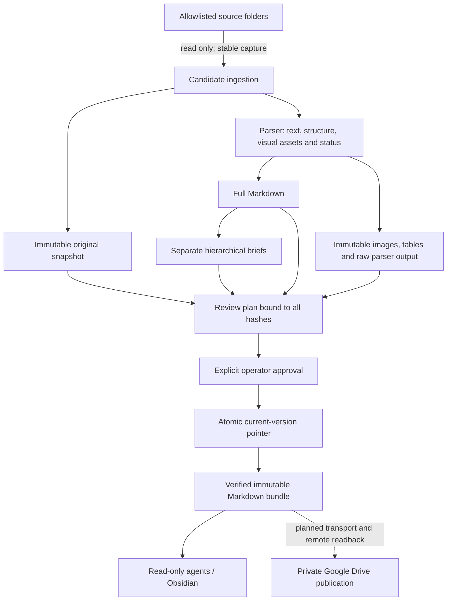

# Architecture

The [product specification](product-spec.md) records the agreed clinical-laboratory
and IVD quality-management scope and separately managed de-identification engine.
This page describes the implemented document core; broader product capabilities
are staged work, not completed features.

## Two planes, one explicit publication boundary

The **data plane** contains originals, full extraction, navigation briefs and current manifests. The **control plane** contains policy, review plans, receipts and audit events. A reading agent gets a published bundle or a constrained read API. A curator may propose changes. A trusted operator owns publication.

The librarian need not be another LLM. The small catalog plus deterministic retrieval API already implements that role. An LLM can interpret the user's request and choose a category; correctness does not depend on it remembering folder IDs or enforcing policy itself.

The spatial-library idea is related to [MemPalace](https://github.com/MemPalace/mempalace), whose documented focus is verbatim conversation memory with scoped semantic retrieval. This project applies a library metaphor to governed source documents using explicit Markdown navigation and lexical retrieval. It does not depend on or copy MemPalace's implementation.



## Sources of authority

| Question | Authority | Not a substitute |
| --- | --- | --- |
| What bytes did we ingest? | Immutable source snapshot and SHA-256 | Filename or modification time |
| What did the parser return? | Version-bound `extraction.json`, all pages | Brief, nonempty file, `FULL` filename label |
| Which version should retrieval use? | Transactional document current pointer; exported bundle | Newest-looking filename or local cache timestamp |
| What can be published? | Executable policy plus exact approved plan | Instructions inside a document |
| Is a license/claim legally current? | A separately validated authority with provenance | Extraction status or publication status |
| Did a remote release succeed? | Remote asset verification and pointer readback, planned | Local exit code or upload initiation |

Document ID is stable within this runtime; version ID identifies one immutable ingestion result. Same bytes in two source contexts can be two documents sharing a blob. A renamed source is not silently merged with an existing ID: migration needs an explicit binding operation, not yet implemented. Revision relationships across different physical files or languages also need an operator-defined document-family model in a later version.

## Stored state

```text
private-runtime/
  policy.json          # Source allowlists and executable limits
  library.sqlite3      # Identity, versions, plans, audit and scan observations
  objects/<sha256>     # Originals, Markdown, extraction/brief JSON, images and tables

private-release/
  00_CONSTITUTION.md
  _AI_MAP.md
  groups/<category>.md # Additional catalog pages generated when needed
  documents/<version>/
    original.pdf      # Or another supported original extension
    full.md
    extraction.json
    assets/<sha>.png   # Page previews or embedded images
    assets/<sha>.html  # Escaped tables with merged cells
    brief.md
    sections/1.md     # Only needed for larger documents
  bundle.json         # Written last; contains every exported file hash
```

Use **local disk** for the runtime; do not place SQLite on an SMB/NFS/cloud-synchronized folder. NAS may hold the read-only sources. The Python standard library handles identity, JSON, hashing and transactions. SQLite is an explicit state ledger, not a vector index. Portable bundles are plain files that remain readable without SQLite or Python.

Every full document has one full Markdown per version. Extra `sections/*.md` are smaller navigation briefs, not alternate full texts. Catalogs have at most 32 child links, document briefs at most eight. Small source excerpts keep navigation inspectable. Current grouping follows categories and page ranges, not semantic headings; long plain-text inputs currently have one logical page.

Extraction schema 2 records visual assets and parser capabilities. Existing schema 1
versions are read without migration. Asset hashes are transitively bound to approval
through the extraction hash and are checked by reads, publication and bundle export.
The same source hash can have multiple extraction versions; parser upgrades do not
replace current automatically. Office sections/worksheets are explicitly logical
locations, not printed pages. See [fidelity limits](parsers.md).

The content store writes an object to a temporary file, flushes it, then atomically links it into its hash address without overwriting an existing blob. Publication updates current state and audit within one SQLite transaction, followed by a new-connection readback. Interrupted ingestion may leave an unreferenced blob; automatic garbage collection is deliberately absent. Power-loss durability, disk corruption and loss of the entire device require independent backup and restore testing.

## Ingestion and reconciliation

`scan` inventories every allowed root; file notifications can trigger it, but do not replace reconciliation. Two identical observations and a quiet interval reduce incomplete-copy reads. Capture also verifies pre/post file metadata and a bounded byte count. An unchanged successful input is rehashed without rerunning the parser; explicit `ingest` requests re-extraction, including after a tested parser upgrade.

Scans stage candidates. They never approve or publish them. A root failure makes inventory incomplete; current reads, search, export and new publication then fail with `STALE_INDEX` unless the read caller explicitly requests stale access. A missing individual file is reported in the scan result and leaves retained publication intact. Inventory freshness means the scan succeeded recently, **not** that every source still exists or every newer candidate has been reviewed. Consumers must examine scan exceptions and candidate warnings.

Retrieval is bounded in returned results but currently performs a linear lexical search and integrity verification over the current corpus. Progressive disclosure reduces **agent context**, not the server's total search work. For large collections, benchmark first; a rebuildable SQLite FTS or metadata index is a possible optimization without introducing vectors. Export currently constructs a bundle in memory; large corpora need streaming and measured limits before production deployment.

## Publication and transport

Changing content, parser output or metadata creates a candidate version. Current changes only through a reviewed plan. `archive` clears current while retaining history; `restore` explicitly selects a previously published version. Restoring old bytes does not make them the latest upstream content.

An export is an immutable snapshot, not a live mirror. `bundle.json` binds exact files, document references and the policy hash. A partial export has no accepted complete manifest; readers must verify before adopting it. Hash verification detects corruption; it does not authenticate who created the bundle. Pin an expected manifest digest from a trusted release channel. Signed remote manifests and compare-and-swap cloud pointers are required design work for the transport phase.

Relative Markdown links work in a filesystem/Obsidian bundle. Google Drive's native file viewer does not supply the same filesystem semantics; its adapter must resolve manifest-relative paths to version-specific Drive IDs or serve a read API. Simply uploading the folder is not a complete agent integration.
