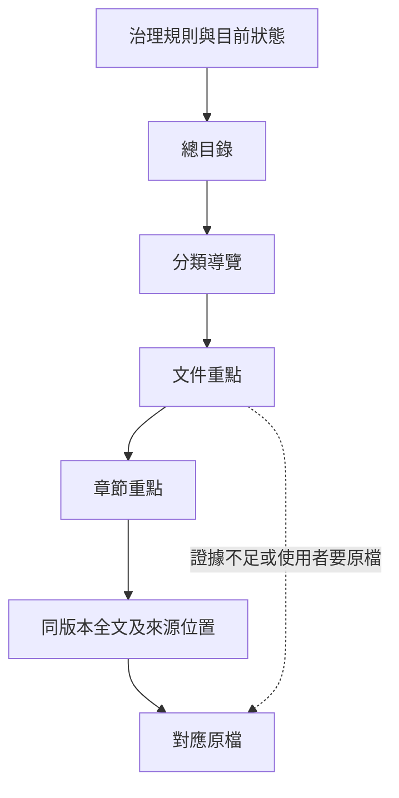

# Product specification

Status: agreed product direction. The implementation remains a document-library
reference core; a capability described here is not a claim that it already exists.

## 產品與開源邊界

目標是服務醫院檢驗科與 IVD 公司的品質管理系統。文件圖書館是基礎模組，
完整產品還包括文件簽核、教育訓練、內部稽核、品質事件與矯正措施、
責任分派及完成證據。商業模式以導入及維護服務為主。

公開治理架構、資料契約、串接介面、參考實作及合成測試資料。
去識別化引擎獨立管理，可接既有工具或其他實作；引擎、模型、解析器與
客戶資料的授權分別處理。本規格不修改目前的 MIT LICENSE，
也不把既有私有工具或資料公開。

## 兩種權責模式

| 模式 | 正式版本及生效狀態的權威 | 系統責任 |
| --- | --- | --- |
| 參考資料庫 | 客戶既有制度或系統 | 保存獲准副本、來源、版本、取得時間與已知狀態，提供查詢證據 |
| 完整管理 | 本系統內經授權的流程 | 管理核准、生效、訓練條件、歷史版本及稽核紀錄 |

模式由部署設定指定，不能由 agent 猜測。取得時間、核准時間、生效時間、
到期時間與來源版本分開。正式狀態缺漏就標記未知。兩種模式都可提供
網頁介面，讀取介面不代表已取得正式管理權。

## 文件與逐層閱讀

每個來源版本保留原檔、全文 Markdown、獨立重點 Markdown 及 manifest。
來源版本與解析器產出版本分開：重新 OCR 不等於來源改版。

- 分層閱讀節省上下文，不是權限機制，也不強迫讀完所有層才能開原檔。
- 全文保留解析器回傳的全部文字及位置。缺頁、OCR 疑義、表格或圖像
  未表達的部分須揭露；Markdown 不保證與原始版面百分之百等價。
- AI 可以改寫重點，但每項重點必須回到同版本全文範圍。重點不能代替
  全文、正式核准或法規有效性證據。現行核心使用原文摘錄，語意重點待實作。
- 原檔、全文、重點與索引由明確 ID 及雜湊綁定。檔名可找候選，不能憑
  名稱或日期排序自行建立取代關係。語言、地區、產品適用範圍分開處理。
- 證據不足時回答已知部分並列缺口；不足以判定能否使用時回覆無法判定。
  已封存文件以明確歷史用途取得，不默認為現行答案。

Markdown 用來閱讀；一般結構化資料庫管理版本、權限、流程及稽核。
不要求向量庫。索引可重建，正式核准證據不能靠摘要重建。

## 生命週期與治理

內部文件繼續使用 Word／Excel 編輯，送入系統審閱。外部 IFU 等來源更新
形成候選版與影響提示，不自動改動醫院自己的 SOP。

候選／審閱中 → 已核准待生效 → 生效 → 已取代或已封存。
審閱可退回修改；舊生效版在切換前保持可用。是否立即生效、是否需必要
人員完成訓練，由機構政策與文件類型決定，並非所有文件一律相同。

初期 AI 分類、解析、比對、建立索引、提示缺漏及起草建議；正式生效、
撤回及改善案件結案由授權人員決定。未來才開放明確授權的低風險自動
決策。文件內容是資料，不是能改變系統規則的指令。

寫入需要具體計畫、版本前置條件、操作紀錄、備份與回復路徑。
失敗、部分成功與待確認分開記錄；檔案存在或 exit code 不能代替驗證。
第一階段封存並保留歷史，沒有永久刪除功能；保留及銷毀規則後續另訂。

## 醫院與 IVD 規則套件

醫院檢驗科以 ISO 15189 與適用 CAP 要求為目標領域；IVD 公司依角色、
所在地與活動配置 ISO 13485 及適用 GDP／GMP／QMS 規則。每個套件明訂
機構類型、司法管轄、標準版本、適用範圍及生效日期。
不同制度不混成通用合規判定，具備軟體功能不代表已取得認證。
規則來源及更新需維護，受著作權保護的標準全文不放入公開 repo。
許可證效期等事實由指定權威及其證據判定；來源矛盾列入待確認清單。

## 院內運作與未來雲端分析

核心流程在客戶環境獨立運作；沒有外網或 AI 時，人工查閱、核准與管理
仍應可用。雲端與模型為可選介面。第一階段處理品質文件及管理紀錄，
不收可識別病人的原始資料；員工訓練與簽核仍需員工身分。

未來路徑：院內原始病人資料 → 獨立去識別化引擎 → 輸出政策檢查
→ 獲准雲端 AI → 分析結果回院內。第一個用途是品質與營運分析，
個案輔助與研究是後續方向。

去識別化完成與允許上雲是獨立判定。由機構核准處理及輸出政策，
依目的、必要欄位與再識別風險決定範圍，不能只刪姓名就宣稱可以輸出。
分析方案先核准用途、資料來源／欄位、雲端服務及執行條件；範圍內可
自動執行，用途、欄位或服務改變需重新審閱。

每次執行記錄方案及政策版本、執行身分、資料版本與雜湊、引擎版本、
處理檢查報告、實際模型／服務、結果與來源關係。檢查失敗不得放行。
分析結果可追溯使用的資料與版本，由院內授權人員回查原始個案；
身分對照資料留在院內，回查留紀錄。可回連的代碼不稱為不可逆匿名。
輸出粒度由方案決定，不假設所有任務都需要逐筆或只需彙總資料。

## 實作順序與驗收

1. **文件治理實證**：盤點、對帳、備份與修復既有私有庫，走真實 agent
   讀取路徑驗證。公開只提交通用工具及合成測試。
2. **完整品質流程**：加入獨立身分、角色、核准／生效、訓練、內稽與
   改善案件，每個流程提供可驗收的端到端案例。
3. **院內資料及引擎整合**：先以合成資料驗證來源追蹤、去識別化契約、
   院內回查與失敗隔離，再依客戶授權驗證實際資料。
4. **受控雲端分析**：實作方案授權、輸出檢查、雲端處理與結果回流。
   未通過實際部署驗收前，不能稱為可處理病人資料的產品。

整理既有庫先盤點入口、消費端及權威來源，保留有效 ID、連結與人工
筆記；可逆的機械修復可以執行，正式版本或語意不明的資料保留待確認。
不以建立平行資料樹代替遷移，也不將試點整理宣稱為完整 QMS 已上線。
